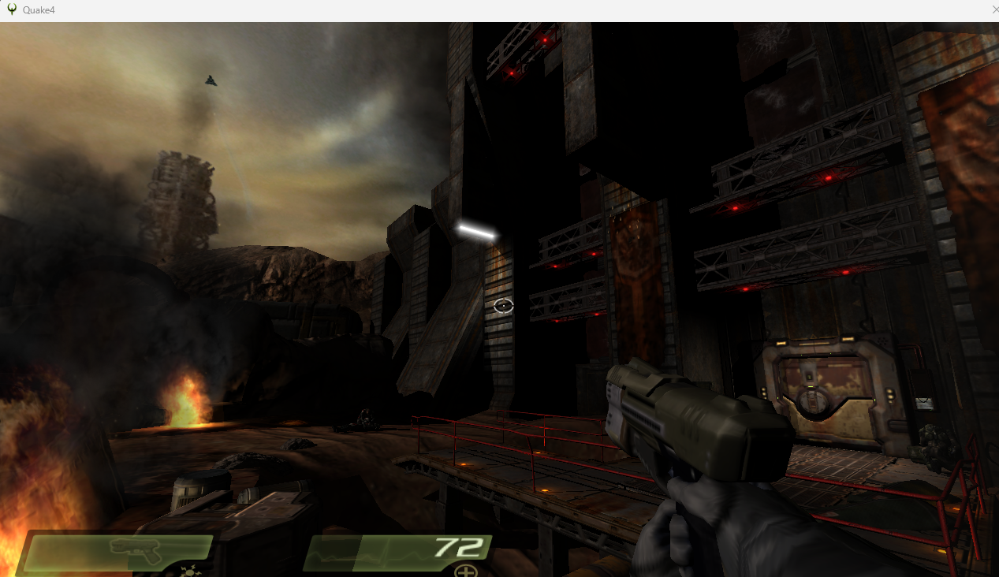
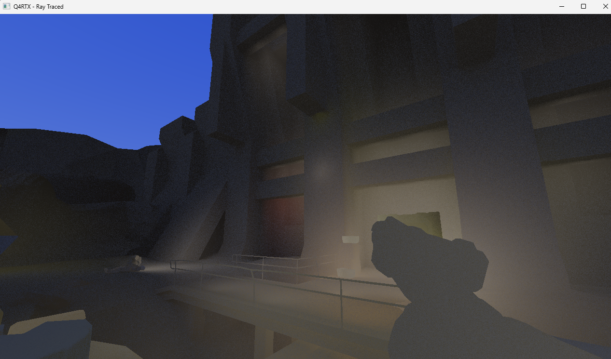

# Q4RTX

Ray tracing mod for Quake 4. Intercepts OpenGL calls, extracts geometry, and re-renders it with DXR in real time.

| In-game (OpenGL) | Q4RTX (DXR) |
|---|---|
|  |  |

## How it works

Quake 4 is 32-bit and uses OpenGL. DXR needs 64-bit D3D12. So this runs as two processes:

- A **proxy DLL** (`opengl32.dll`) that lives inside the game process, hooks ~60 GL functions, and captures world geometry each frame.
- A **standalone renderer** (`q4rtx_renderer.exe`) that reads the captured data from shared memory and renders it with hardware ray tracing.

They talk through a 64MB memory-mapped file with a pair of Windows events for synchronization.

### What the proxy captures

Only 3D world geometry — it filters by depth test/write state, skips 2D overlays (ortho projection), and only grabs triangle primitives. Vertex and index data comes from either client arrays or VBOs. Lights are pulled from ARB program parameters (id Tech 4 passes light origin as VP param 0, color as FP param 0).

### What the renderer does

Builds a bottom-level acceleration structure from all the geometry, wraps it in a single TLAS instance, and dispatches rays. The shader does one-bounce GI, ambient occlusion, direct lighting with shadow rays, and a procedural skybox.

## Building

You need Visual Studio 2022+ with C++20, CMake 3.20+, and a DXR-capable GPU.

```bat
build.bat
```

Or manually:

```bat
cmake -S . -B build32 -A Win32
cmake --build build32 --target q4rtx_proxy --config Release

cmake -S . -B build64 -A x64
cmake --build build64 --target q4rtx_renderer --config Release
```

## Running

1. Drop `opengl32.dll` (from `build32/bin/proxy/Release/`) into your Quake 4 folder
2. Drop `q4rtx_renderer.exe` (from `build64/bin/renderer/Release/`) next to it
3. Copy the `shaders/` folder there too
4. Launch the game — the proxy starts the renderer automatically

To uninstall, just delete `opengl32.dll` and `q4rtx_renderer.exe` from the game folder.

## Project layout

```
src/proxy/          32-bit proxy DLL — GL hooks, state tracking, frame capture
src/renderer/       64-bit DXR renderer — D3D12, acceleration structures, ray dispatch
src/shared/         Types shared between both sides (IPC layout, math)
shaders/            HLSL ray tracing shaders
```

Key files in the proxy: `gl_hooks.cpp` (draw call interception), `frame_sender.cpp` (geometry filtering and IPC), `vertex_extract.cpp` (reading GL vertex arrays/VBOs).

Key files in the renderer: `renderer.cpp` (frame loop), `scene.cpp` (acceleration structure building), `rt_pipeline.cpp` (root signature and PSO), `rt_shaders.hlsl` (the actual shading).

## Shared memory layout

Each frame, the proxy writes to shared memory in this order: frame header (camera, counts) → mesh headers (per-mesh offsets) → vertex data (position + normal) → index data → light data.

Sync uses two auto-reset events: `Q4RTX_DataReady` (proxy signals after writing) and `Q4RTX_DataRead` (renderer signals when done reading). If the renderer consumes `DataReady`, it *must* signal `DataRead` back, even if it skips the frame — otherwise the proxy blocks forever.

## Shader registers

| Register | What |
|----------|------|
| u0 | Output texture (UAV) |
| t0 | TLAS |
| t1 | Vertex buffer (pos + normal) |
| t2 | Index buffer |
| t3 | Light buffer |
| b0 | Camera constants |
| b1 | Skybox constants |
